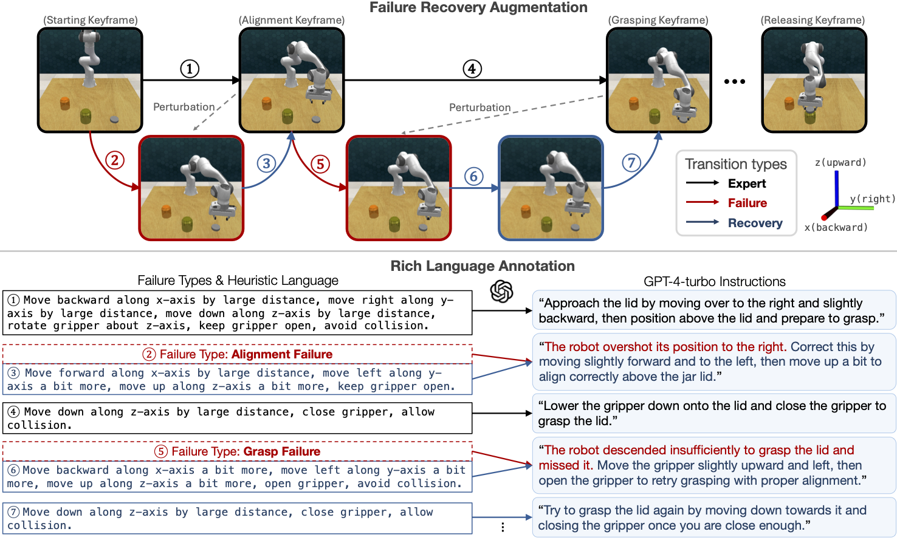

# RACER: Data Generation Pipeline
Rich Language-guided Failure Recovery Data Augmentation Pipeline

<div style="text-align: center;">
  
</div>

## Getting Started

### Install RACER Data Gen

- **Step 1:**
  ```
  conda create --name racer_datagen python=3.9
  conda activate racer_datagen
  ```

- **Step 2:**
Follow Steps 2 to 4 from [RACER](https://github.com/sled-group/RACER).

- **Step 3:**
  ```
  cd <PATH_TO_RACER_DATA_GEN>
  git submodule update --init
  export COPPELIASIM_ROOT=<YOUR_PATH>/CoppeliaSim_Edu_V4_1_0_Ubuntu20_04
  pip install -e .
  pip install -e racer_datagen/libs/PyRep
  pip install -e racer_datagen/libs/RLbench
  pip install -e racer_datagen/libs/YARR
  pip install -e racer_datagen/libs/peract_colab/
  ```

### Generate Data
- **Step 1: Download Existing Expert Demos**
Follow [RACER](https://github.com/sled-group/RACER#prepare-data) instructions for downloading the expert demos. The path for the expert demo will be `RACER/racer/data/rlbench/xxx` where `xxx` is either `train`, `test`, or `val`. Create a symbolic link (RACER-DataGen/data) to this dataset dir in RACER-DataGen repo. mkdir RACER-DataGen/runs.

- **Step 2: Augment Expert Demo**
We will generate augmented expert trajectories to `RACER/racer/data/augmented_rlbench/xxx`, where `xxx` is either `train` or `val`.

  ```
  # Update api keys in this file.
  RACER-DataGen/racer_datagen/prompts/api.py

  # Update BASE_PATH in this file.
  RACER-DataGen/racer_datagen/utils/const_utils.py

  cd racer_datagen

  # Generates data to train RACER annotated_episode.pkl, language_description.json, actions.csv
  python online_rollout/generate_data.py
  
  # Generate data from task idx 0 to 18 for 100 episodes each with 5 perturbations on the train dataset. 
  vncserver :<DISPLAY_ID>
  DISPLAY=:<DISPLAY_ID> python online_rollout/generate_data.py --start_idx 0 --end_idx 18 --num_of_ep 100 --ep_offset 0 --M 5 --train

  # Converts language_description.json to llava.json to fine-tune RACER's VLM supervisor
  # Make sure to update the save_path
  python prompts/lang_json_to_llava_json.py
  ```


### Data Format
```
Task
└── Episode
    │   # visual observations
    ├── front_rgb/
    ├── front_depth/
    ├── left_shoulder_rgb/
    ├── left_shoulder_depth/
    ├── right_shoulder_rgb/
    ├── right_shoulder_depth/
    ├── wrist_rgb/
    ├── wrist_depth/
    │
    │   # annotated data
    ├── actions.csv: raw wapoint actions (7DoF EE pose, gripper, collision)
    ├── annotated_episode.pkl
    ├── llava.json: for training LLaVA supervisor VLM
    ├── language_description.json
    ├── output/: contains gif, input prompts, extra info
    └── obs.pkl
```


### Directory Structure
```
RACER-DataGen
└── racer_datagen
    ├── data
    │   ├── train
    │   ├── val
    │   ├── test
    ├── runs
    │   └── save path for the augmented data
    ├── data_aug
    │   ├── base
    │   │   ├── base configs
    │   │   └── classes for Action, Waypoint, Perturbation, Episode
    │   └── configs
    │       └── specific config files for each task
    ├── online_rollout
    │   ├── base
    │   │   ├── classes for Agents
    │   │   ├── classes for Rollouts
    │   │   ├── classes for constants
    │   │   └── classes for Simulators
    │   └── generate_data.py
    └── prompts
        ├── api.py: api for prompting
        ├── task_specific_descriptions.py: descriptions for each task
        ├── task_specific_examples.py: example input-output prompt for harder tasks
        ├── example_prompt.py: previously attempted prompts
        ├── main_prompt.py: main prompt template
        ├── episode_to_json_converter.py
        ├── lang_json_to_llava_json.py
        ├── lang_json_to_llava_json_ver2.py
        └── test
            ├── check_lang_desc_exist.py
            ├── check_truncated_text.py
            └── test_episode_to_json_converter.py


```

### Some Comments
- The language encoder for RACER can take up to 77 tokens. Make sure that the GPT-annotated rich language is less or equal to 77 tokens. Otherwise, the instructions will be truncated. You may have to identify these truncated annotations and prompt again. Check prompts/check_truncated_text.py
